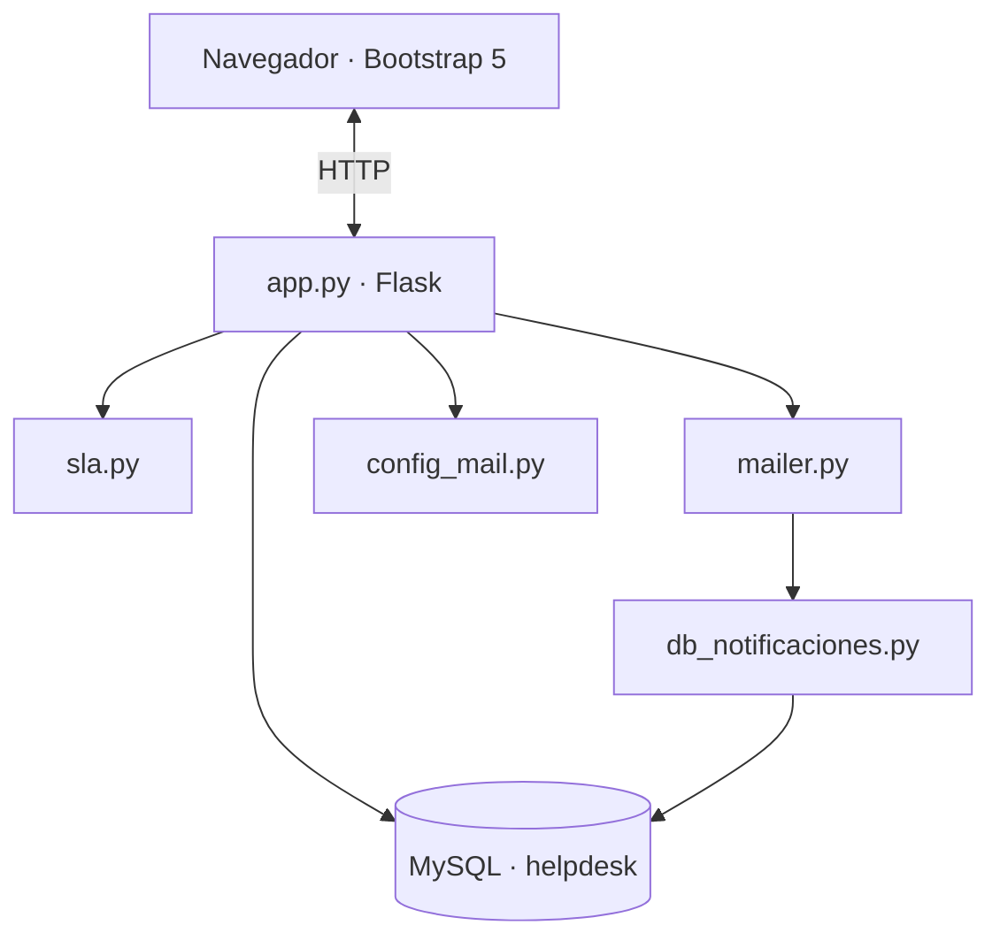
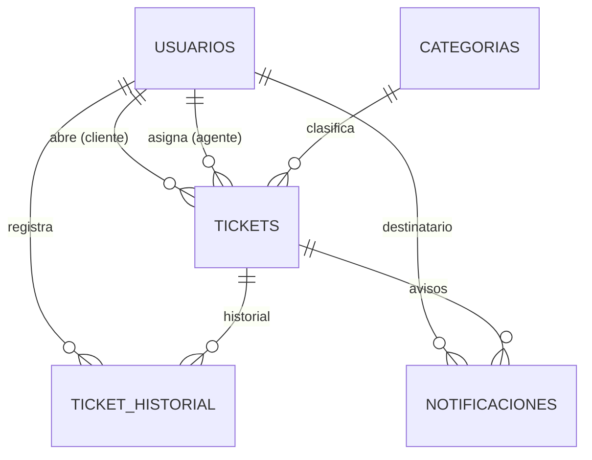
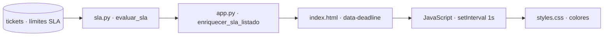

# Manual técnico — Helpdesk

## 1. Objetivo del sistema

Aplicación web de mesa de ayuda (helpdesk) que permite:

- A los **clientes**: abrir peticiones, consultar estado y comentar.
- A los **agentes**: gestionar tickets, asignarse incidencias, responder y controlar SLA.
- A los **administradores**: gestionar usuarios, categorías y revisar el historial de correos.

> La base de datos se entrega completa en `helpdesk.sql` (export de phpMyAdmin).

---

## 2. Arquitectura general



**Flujo resumido:** el navegador habla con Flask (`app.py`); la lógica auxiliar está en `sla.py`, `mailer.py` y `config_mail.py`; los correos se registran con `db_notificaciones.py`; todo persiste en MySQL.

- **Presentación:** plantillas Jinja2 en `templates/` + estilos en `static/css/styles.css`.
- **Lógica de negocio:** concentrada en `app.py`, con módulos auxiliares para SLA y correo.
- **Persistencia:** MySQL mediante `mysql.connector`, cursor global `micursor`.

---

## 3. Estructura de archivos

| Ruta | Descripción |
|------|-------------|
| `app.py` | Aplicación Flask: rutas, sesión, consultas SQL, orquestación |
| `sla.py` | Cálculo de plazos SLA y evaluación (en plazo / riesgo / vencido) |
| `mailer.py` | Envío SMTP y avisos automáticos (ticket nuevo, comentarios, etc.) |
| `config_mail.py` | Carga `mail.env` y variables de entorno de correo |
| `db_notificaciones.py` | Inserción y listado de `notificaciones`|
| `mail.env` | Configuración SMTP real (no subir a repositorio; crear desde `mail.env.example`) |
| `mail.env.example` | Plantilla de configuración de correo |
| `helpdesk.sql` | **Base de datos completa** (estructura + datos) para importar en MySQL |
| `templates/` | Vistas HTML (base, index, detalle, dashboard, login, etc.) |
| `static/css/styles.css` | Estilos visuales de la aplicación (paleta pastel, sidebar, tarjetas) |
| `MANUAL_USUARIO.md` | Manual de uso para usuarios finales |
| `MANUAL_TECNICO.md` | Este documento |

---

## 4. Base de datos `helpdesk`

### 4.1 Instalación de la base de datos

1. Abrir **phpMyAdmin** (o consola MySQL).
2. Pestaña **Importar** → seleccionar **`helpdesk.sql`**.
3. Ejecutar. El script crea la base `helpdesk`, las tablas y los datos de ejemplo.


### 4.2 Tablas del sistema

#### `usuarios`

| Columna | Tipo | Descripción |
|---------|------|-------------|
| `id` | INT PK AI | Identificador |
| `nombre` | VARCHAR | Nombre completo |
| `email` | VARCHAR | Correo (login único) |
| `password` | VARCHAR | Hash bcrypt (`werkzeug.security`) |
| `rol` | VARCHAR | `cliente`, `agente` o `admin` |
| `reset_token` | VARCHAR(64) NULL | Token para enlace de recuperación de contraseña |
| `reset_token_expira` | DATETIME NULL | Caducidad del token (24 h) |

#### `tickets`

| Columna | Tipo | Descripción |
|---------|------|-------------|
| `id` | INT PK AI | Número de ticket |
| `titulo` | VARCHAR | Asunto breve |
| `descripcion` | TEXT | Detalle de la incidencia |
| `estado` | VARCHAR | `Abierto`, `En proceso`, `Cerrado` (por defecto Abierto) |
| `prioridad` | VARCHAR | `baja`, `media`, `alta` |
| `archivo` | VARCHAR | Nombre del fichero adjunto |
| `archivo_blob` | LONGBLOB | Contenido binario del adjunto |
| `usuario_id` | INT FK | Cliente que abrió el ticket |
| `agente_id` | INT FK | Agente asignado; NULL = sin asignar |
| `categoria_id` | INT FK | Categoría del ticket |
| `cerrado_en` | DATETIME | Fecha/hora de cierre |
| `sla_respuesta_limite` | DATETIME | Plazo máximo de primera respuesta |
| `sla_resolucion_limite` | DATETIME | Plazo máximo de resolución |
| `primera_respuesta_en` | DATETIME | Primera respuesta pública de agente/admin |
| `creado_en` | DATETIME | Fecha de alta |

#### `categorias`

| Columna | Tipo | Descripción |
|---------|------|-------------|
| `id` | INT PK AI | Identificador |
| `nombre` | VARCHAR | Nombre único (General, Hardware, Software, etc.) |

#### `ticket_historial`

| Columna | Tipo | Descripción |
|---------|------|-------------|
| `id` | INT PK AI | Identificador |
| `ticket_id` | INT FK | Ticket relacionado |
| `usuario_id` | INT FK | Quién realizó la acción |
| `tipo` | VARCHAR | `creado`, `comentario`, `estado`, `prioridad`, `asignacion`, `archivo`, etc. |
| `detalle` | TEXT | Texto descriptivo |
| `es_interno` | TINYINT | 1 = nota solo visible para agente/admin |
| `fecha` | DATETIME | Marca temporal |

#### `notificaciones`

| Columna | Tipo | Descripción |
|---------|------|-------------|
| `id` | INT PK AI | Identificador |
| `ticket_id` | INT FK | Ticket relacionado |
| `email` | VARCHAR | Destinatario |
| `tipo` | VARCHAR | Evento (`ticket_creado_cliente`, `comentario_agente`, etc.) |
| `asunto` | VARCHAR | Asunto del correo |
| `cuerpo` | TEXT | Cuerpo del mensaje |
| `enviado` | TINYINT | 1 = enviado correctamente |
| `error_msg` | VARCHAR | Error SMTP si falló |
| `creado_en` | DATETIME | Fecha del intento de envío |

### 4.3 Diagrama entidad-relación (simplificado)



---


## 5. Rutas Flask (`app.py`)

Cada ruta lleva un comentario `# RUTA:` en el código fuente.

| Ruta | Función | Acceso |
|------|---------|--------|
| `/` | Listado de tickets con filtros | Sesión requerida |
| `/ticket/nuevo` | Crear ticket | Cliente+ |
| `/login` | Autenticación | Público |
| `/register` | Alta de cliente | Público |
| `/logout` | Cerrar sesión | Sesión |
| `/descargar/<id>` | Descarga adjunto BLOB | Según permisos |
| `/ticket/<id>` | Detalle, comentarios, gestión | Según rol |
| `/usuarios` | Listado usuarios | Admin |
| `/usuario/editar/<id>` | Editar usuario | Admin |
| `/usuario/eliminar/<id>` | Eliminar usuario (POST con confirmación UI) | Admin |
| `/categorias` | CRUD categorías | Admin |
| `/dashboard` | Estadísticas y SLA | Agente, admin |
| `/notificaciones` | Historial de correos | Admin |
| `/manual/usuario` | Manual de usuario (HTML) | Público |
| `/manual/tecnico` | Manual técnico (HTML) | Público |
| `/olvide` | Solicitar enlace de recuperación por correo | Público |
| `/cuenta/cambiar-contrasena` | Enviar enlace de cambio (usuario logueado) | Autenticado |
| `/reset/<token>` | Formulario nueva contraseña (token del correo) | Público |

**Sesión Flask** (`session`): `usuario_id`, `usuario_nombre`, `usuario_rol`.

**Clave secreta:** `app.secret_key = os.urandom(24)` — las sesiones se invalidan al reiniciar el servidor (comportamiento documentado en FAQ).

---

## 6. Módulos auxiliares

### 6.1 `sla.py`

- Constante `SLA_HORAS`: plazos por prioridad (baja/media/alta).
- `calcular_limites_sla(prioridad, creado_en)` → tupla (límite respuesta, límite resolución).
- `evaluar_sla(ticket)` → diccionario con estados, límites (`limite_respuesta`, `limite_resolucion`), `estado_global` y `deadline_activo`.
- `RIESGO_FRACCION = 0.25`: último 25 % del plazo = «en riesgo» (badge SLA).
- `marcar_primera_respuesta()` al primer comentario público de agente/admin.
- `etiqueta_estado(codigo)` → texto legible para plantillas (En plazo, Vencido, etc.).

### 6.2 `mailer.py` + `config_mail.py`

- Lee `mail.env` (IONOS, Gmail u otro SMTP).
- `MAIL_ENABLED=0` desactiva envío; la app sigue funcionando.
- Eventos que disparan correo: ticket nuevo, comentarios, cambio estado, asignación.
- Cada intento se registra en `notificaciones` vía `db_notificaciones.py`.

### 6.3 `db_notificaciones.py`

- Detecta columnas reales de `notificaciones` (`creado_en`, `fecha_envio`, `mensaje`, etc.).
- Normaliza filas para plantillas aunque la tabla tenga columnas de esquemas anteriores mezcladas.

---

## 7. Seguridad y buenas prácticas implementadas

| Aspecto | Implementación |
|---------|----------------|
| Contraseñas de acceso | `generate_password_hash` / `check_password_hash` (Werkzeug) en `password` |
| Recuperación de contraseña | Token `secrets.token_urlsafe(32)` + caducidad 24 h; enlace en correo vía `mailer.enviar_recuperacion_contrasena` |
| SQL injection | Consultas parametrizadas con `%s` y tuplas de valores |
| Archivos | `secure_filename` en subida; almacenamiento en BLOB |
| Autorización | Comprobación de `session` y `usuario_rol` en cada ruta sensible |
| Notas internas | Filtro `es_interno = 0` en historial para clientes |
| Tickets cliente | `WHERE t.usuario_id = %s` en consultas de detalle/listado |

---

## 8. Interfaz de usuario

- **Bootstrap 5.3.3** (CDN).
- **Sidebar** fijo bajo navbar (`top: 64px`); toggle móvil con ☰.
- **Listado en tarjetas** (`index.html`): badge SLA arriba a la derecha; estado del ticket en el cuerpo de la tarjeta; contadores SLA en vivo.
- **Filtro Jinja `fecha_es`:** formato `DD-MM-AAAA HH:MM`.
- **Paleta:** verde (ok/abierto/baja/cumplido), amarillo (proceso/media/riesgo), naranja (contador &lt; 2 h), rojo (cerrado/alta/vencido).

### 8.1 Contadores SLA en listado de tickets

Solo visibles para **agente** y **admin** en `templates/index.html`.

**Estructura de cada tarjeta (zona SLA):**

1. Badge **SLA:** + `estado_global` (calculado en servidor con `evaluar_sla`).
2. Línea **1ª respuesta:** — cuenta atrás hasta `sla_respuesta_limite` o «Cumplida» si existe `primera_respuesta_en`.
3. Línea **Resolución:** — «Cerrada en plazo» (verde) o «Cerrada fuera de plazo» (rojo) según `estado_resolucion`; cuenta atrás si sigue abierto.

**Lógica en cliente (JavaScript embebido en `index.html`):**

- Cada línea activa lleva `data-deadline` con fecha límite ISO.
- `setInterval(..., 1000)` recalcula el texto cada segundo.
- Umbral urgente: `2 * 60 * 60 * 1000` ms (2 horas).
- Clases CSS en `static/css/styles.css`:
  - `.sla-timer` — texto negro por defecto.
  - `.sla-timer-urgente` — naranja (`#e67e22`) si quedan &lt; 2 h.
  - `.sla-timer-vencido` — rojo si el plazo ya pasó.
  - `.sla-timer-cumplido` — verde si cumplida/cerrada.

**Flujo de datos:**



Plantillas principales: `base.html`, `index.html`, `ticket_detalle.html`, `dashboard.html`, `login.html`, `register.html`, `olvide_contrasena.html`, `reset_password.html`, `solicitar_cambio_contrasena.html`, `new_ticket.html`, `usuarios.html`, `editar_usuario.html`, `categorias.html`, `notificaciones.html`, `manual_view.html`.

---

## 9. Instalación y ejecución

### 9.1 Obtener el proyecto

1. Clonar el repositorio desde GitHub (rama **`main`**). GitHub Desktop o `git clone` crearán la carpeta en la ruta que elija cada usuario.
2. Abrir esa carpeta: es la raíz del proyecto (contiene `app.py`, `helpdesk.sql` y `templates/`).

### 9.2 Requisitos

- Python 3.x
- MySQL / MariaDB (servicio activo)
- Paquetes: `flask`, `mysql-connector-python`, `werkzeug`

```bash
pip install flask mysql-connector-python werkzeug
```

### 9.3 Base de datos

1. Importar **`helpdesk.sql`** en phpMyAdmin (crea la base, tablas y datos).
2. Verificar conexión en `app.py`:

```python
mibd = mysql.connector.connect(
    host="localhost",
    user="root",
    password="",
    database="helpdesk"
)
```

### 9.4 Correo (opcional)

Copiar la plantilla y editarla (Windows: `copy`; Linux/Mac: `cp`):

```bash
copy mail.env.example mail.env
```

Editar `mail.env` con datos SMTP (ejemplo IONOS: `smtp.ionos.es`, puerto 587, STARTTLS).

### 9.5 Arranque

Desde la **raíz del repositorio clonado** (carpeta con `app.py`):

```bash
python app.py
```

Abrir http://127.0.0.1:5000

---

## 10. Flujos de negocio relevantes

### 10.1 Creación de ticket

1. POST `/ticket/nuevo` → INSERT en `tickets` con límites SLA.
2. `registrar_historial(..., 'creado', ...)`.
3. `mailer.on_ticket_nuevo()` → cliente y equipo.

### 10.2 Tomar ticket (agente)

1. UPDATE `agente_id`, posible cambio a «En proceso».
2. Historial tipo `asignacion`.
3. Notificación al agente si aplica.

### 10.3 Comentario agente (público)

1. INSERT historial `comentario`.
2. `marcar_primera_respuesta` si es la primera.
3. `mailer` avisa al cliente.

### 10.4 Cierre

1. Estado `Cerrado`, `cerrado_en = NOW()`.
2. Historial + correo al cliente.

### 10.5 Registro de usuario (cliente)

1. POST `/register` → `generate_password_hash(password)`.
2. INSERT en `usuarios` (nombre, email, password, rol=`cliente`).

### 10.6 Recuperación y cambio de contraseña por correo

Requiere `MAIL_ENABLED=1` y `mail.env` configurado (IONOS, etc.):

1. **POST `/olvide`** — Usuario introduce email. Si existe, genera token, guarda `reset_token` + `reset_token_expira` y envía correo con enlace `{APP_BASE_URL}/reset/{token}`.
2. **POST `/cuenta/cambiar-contrasena`** — Usuario logueado; mismo mecanismo al email de su ficha.
3. **GET/POST `/reset/<token>`** — Valida token no caducado; POST actualiza `password` y borra token.
4. Mensaje genérico en `/olvide` (no revela si el email existe).

**Administrador:** POST `/usuario/editar/<id>` con `password` no vacío sigue permitiendo asignar contraseña manualmente.

### 10.7 Gestión y eliminación de usuarios (admin)

1. **GET `/usuarios`** muestra listado con búsqueda (`q`) por nombre/email.
2. **POST `/usuario/editar/<id>`** actualiza nombre, email, rol y contraseña opcional.
3. **POST `/usuario/eliminar/<id>`** elimina la cuenta seleccionada tras confirmación en interfaz.
4. Protección de seguridad: el admin logueado no puede eliminar su propio usuario en esa sesión.

### 10.8 Contadores SLA en listado (agente/admin)

1. `listar_tickets_consulta()` obtiene tickets con JOINs.
2. `enriquecer_sla_listado()` añade `t['sla'] = evaluar_sla(t)` por ticket.
3. `index.html` renderiza:
   - Badge `estado_global` arriba a la derecha.
   - `data-deadline` con `limite_respuesta` y `limite_resolucion`.
4. JavaScript en el navegador actualiza cada segundo el texto «Quedan X» / «Vencido hace X».
5. Colores: negro (&gt; 2 h), naranja (&lt; 2 h), rojo (vencido), verde (cumplida/cerrada).

---

## 11. Consultas SQL destacadas

- **Listado base:** `SQL_TICKET_BASE` — JOIN cliente, agente y categoría.
- **Filtro SLA vencido:** compara `NOW()` con `sla_respuesta_limite` / `sla_resolucion_limite`.
- **Dashboard:** agregaciones `COUNT`, `GROUP BY` por agente y categoría.
- **Historial:** orden `fecha DESC`, filtro `es_interno` para clientes.

---

## 12. Limitaciones conocidas

- Conexión MySQL única global (no pool); adecuado para demo/local.
- `secret_key` aleatoria reinicia sesiones al reiniciar Flask.
- Adjuntos en BLOB (no escalable para ficheros muy grandes).
- Sin API REST ni websockets; interfaz 100 % servidor-renderizada.
- Correo depende de credenciales SMTP en `mail.env`; la recuperación de contraseña **requiere** `MAIL_ENABLED=1`.
- Tokens de reset caducan a las 24 horas y se invalidan al usarse.

---


**Ver en la aplicación:** http://127.0.0.1:5000/manual/tecnico (también desde el pie de página).

---

*Helpdesk — Manual técnico — Junio 2026*


